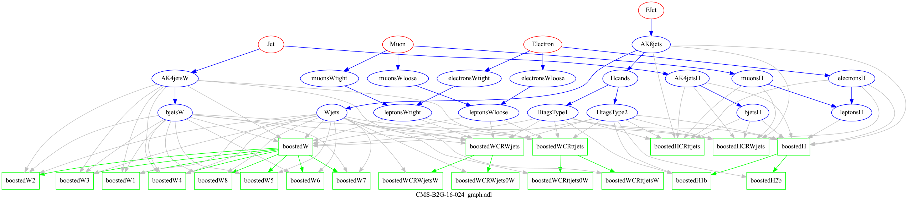

> ## Prerequisites
>
> For this episode please make sure that you have installed the CutLang docker container with ROOT and VNC setup and that you have succesfully tested running CutLang in the container, as described in the previous episode.
> 
> Start the container and start VNC (password: ```cutlang-adl```)
> ~~~
> docker exec -it CutLang-root-vnc bash
>
> start_vnc
> ~~~
> {: .language-bash}
>
{: .prereq}

## Introducing the CMS vector-like quark analysis with 2015 data

We will perform an approximate reproduction of the following new physics search analysis performed with 2015 CMS data:

CMS-B2G-16-024: *Search for pair production of vector-like T and B quarks in single-lepton final states using boosted jet substructure in proton-proton collisions at sqrt(s) = 13 TeV*

arXiv link: ([arXiv:1706.03408](https://arxiv.org/abs/1706.03408)), publication reference: JHEP 11 (2017) 085 .

Download the paper, and glance through the abstract and introduction to have an idea about the model that the analysis is targeting and the final state that the analysis is exploring.

Here are several highlights from the analysis:
  * The analysis searches for pair production of massive vector-like T and B quarks in proton-proton collisions at sqrts = 13 TeV.
    * Data was collected in 2015 by CMS and corresponds to an integrated luminosity of up to 2.6 fb-1. 
  * The T and B quarks are assumed to decay through three possible channels into a heavy boson (either a W, Z or Higgs boson) and a third generation quark. 
  * This search is performed in final states with one charged lepton and several jets, exploiting techniques to identifyWor Higgs bosons decaying hadronically with large transverse
momenta.

Now glance very quickly through the sections 4. Reconstruction methods, 5. Boosted H channels and 6. Boosted W channels to have a rough idea about what kinds of objects and event selections are employed.
Here are several highlights.
* **Objects:** The analysis works with different types objects: electrons, muons, jets, b-jets, boosted Higgs bosons, boosted W bosons
* **Signal regions:** The analysis explores events with exactly 1 electron or muon plus jets/b-jets and various boosted objects with substructure.
  * The analysis looks at 2 different main final states.  Event selection for each final state starts with a common selection, i.e. a preselection.  Then, further selection criteria are applied, which classify the events into more refined signal regions. 
    * Final states with boosted Higgs bosons: This final state is split into 2 search regions.
    * Final states with boosted W bosons: This final state is split into 8 search regions.
  * The boosted Higgs and boosted W selections make use of objects with different definitions of the same object.  For example, they use different definitions for electron, muons, b-jets, etc.
* **Analysis variables:** After signal region selections, analyses look at final distributions of given variable(s) to compare data and background estimates, and eventually to perform statistical analysis (e.g. calculate limits).  The variables are selected to have high discrimination power. For our case, these variables are:
  * for boosted Higgs final states: ST = missing ET + 1st lepton pT + HT (i.e. scalar sum of pTs of all jets)
  * for boosted W final states: min(m(1st lepton, jets)) or min(m(1st lepton, b-jets)), which is the minimum invariant mass among those calculated using the lepton and any of the jets / b-jets in the event.
* **Background estimation:** The analysis performs a "data-driven" background estimation.  In this method, event selections called "control regions" are found, where the background of interest is highly dominant, and where there is negligible contribution from the signals.  The data counts and simulated Monte Carlo event counts in these control regions are used to predict the estimated number of background events in the signal regions. The procedure is beyond the scope of this exercise.  We will directly use MC events as background estimation.  However, we will study the event selection for the control regions.

## ADL file for the analysis

CMS-B2G-16-024 is a very complex analysis with high numbers of object and event selections.  The organized structure of ADL would be a good medium for explaining all this detail in a systematic, unambiguous and self-documenting manner.
We have already written most of the analysis in ADL.  But we will ask you to fill in some blanks.  Let's start by examining the ADL file.

Go to your CutLang docker container, and retrieve the ADL file with the following command
~~~
wget https://raw.githubusercontent.com/ADL4HEP/ADLAnalysisDrafts/main/CMS-B2G-16-024/CMS-B2G-16-024_step1.adl
~~~
{: .language-bash}
This file contains almost all object definitions and a selection of signal search regions in the boosted H and boosted W channels.

Open ```CMS-B2G-16-024_step1.adl``` using ```nano``` or ```vi``` and explore the contents.  

* **Objects:** Look for blocks starting with ```object``` 
  * What objects are selected?  Which requirements exist for each object?
  * How are different types of a certain type of object defined?  For example, how are different types of electrons defined?
  * Are certin objects derived from other objects?  For example, how are the b-jets defined?  How are the boosted H bosons and W bosons defined?
  * How are sets of electrons and muons combined to make leptons?
  * IMPORTANT: Ordering of objects matters.  In order to use a certain object, you should make sure it is defined *above*.
* **Variable definitions:** Look for lines starting with ```define```.  These are literally aliases.  The variable names can be used globally in the event selection afterwards.
  * Which variables are defined and how?
* **Event selection region definitions:** Look for blocks starting with ```region```
  * Can you spot the preselection regions for the boosted H and boosted W channels?  Look for the independent regions.
  * How are the cuts implemented?
  * Can you spot the dependent regions?  These are the final signal search regions where we look for new physics.
  * Which objects are used in which region?  Note that boostedH and boostedW regions use dedicated objects.
  * How do you access the ith object in a collection, for example the 1st jet?
  * Can you spot the *ternary* operation?
  * Can you spot an *optimization*, e.g. a *minimization*?

## Modifying and running the ADL file

Let's first run the ADL file as it is:
~~~
CLA root://eospublic.cern.ch//eos/opendata/cms/upload/POET/23-Jul-22/RunIIFall15MiniAODv2_TprimeTprime_M-800_TuneCUETP8M1_13TeV-madgraph-pythia8_flat.root POET -i CMS-B2G-16-024_step1.adl -e 20000
~~~
{: .language-bash}
We are running over a signal sample which consists of TT production for T mass of 800 GeV.

In the output, you will see cutflows and efficiencies for all regions in the ADL file.  You will also see the output ROOT file ```histoOut-CMS-B2G-16-024_step1.root```.

Now let's make some changes in the ADL file.

> ### **Challenge**: Completing the object selections
>
> Please resist the urge to look at the solution.  Only compare with the proposed solution after you make your own attempt.
>
> Please complete the object selection by adding the following cuts:
>
> * To the ```muonsH``` object, add muon pT > 47 and muon |eta| < 2.1 cuts.
> * To the ```muonsWtight``` object, add muon pT > 40 and muon |eta| < 2.4 cuts.
> * To the ```Hcands``` object, add an AK8 jet pT > 300 cut.
> 
> > ### Solution
> >
> > ~~~
> > # muonsH - for boosted H regions
> > object muonsH
> >   take Muon
> >   select Medium(Muon) == 1 # cut based medium ID 
> >   select isolationVar(Muon) < 0.2
> >   select pT(Muon) > 47
> >   select abs(eta(Muon)) < 2.1
> > 
> > # muonsWtight - for boosted W regions
> > object muonsWtight
> >   take Muon
> >   select Tight(Muon) == 1 # cut based tight ID 
> >   select isolationVar(Muon) < 0.2
> >   select pT(Muon) > 40
> >   select Abs(Eta(Muon)) < 2.4
> > 
> > # Boosted Higgses
> > object Hcands
> >   take AK8jets
> >   select msoftdrop(AK8jets) [] 60 160
> >   select pT(AK8jets) > 300
> > ~~~
> {: .solution}
{: .challenge}

Run CutLang again and check that your changes worked.

> ### **Challenge**: Adding regions
>
> The first paragraph on page 10 of the paper describes the signal search regions in the boosted W final state.  4 of these search regions (with 0 W-tag) are written.  Can you write the other 4 with at least 1 W-tag?  
> Note that AK4jets requirement does not exist for the remaining regions that you will write.
> Also note that we do not make a distinction between electrons and muons, but only require the regions to have 1 lepton.
> 
> > ### Solution
> >
> > ~~~
> > region boostedW5
> >   boostedW
> >   select size(Wjets) >= 1
> >   select size(bjetsW) == 0
> > 
> > region boostedW6
> >   boostedW
> >   select size(Wjets) >= 1
> >   select size(bjetsW) == 1
> > 
> > region boostedW7
> >   boostedW
> >   select size(Wjets) >= 1
> >   select size(bjetsW) == 2
> > 
> > region boostedW8
> >   boostedW
> >   select size(Wjets) >= 1
> >   select size(bjetsW) >= 3
> > ~~~
> {: .solution}
{: .challenge}

You can retrieve the file with completed object and signal region selections as
~~~
wget https://raw.githubusercontent.com/ADL4HEP/ADLAnalysisDrafts/main/CMS-B2G-16-024/CMS-B2G-16-024_step2.adl
~~~
{: .language-bash}

Now let's make some histograms.  In ADL, the histogram syntax is as follows:
* For fixed bin histograms:
~~~
histo <histogram name> , "<histogram title>" , <nbins>, <xmin>, <xmax>, <variable name in ADL>
e.g.
histo hjet1pt , "jet1 pt" , 50, 0, 1000, pt(AK4jets[0])
~~~
* For variable bin histograms:
~~~
histo <histogram name> , "<histogram title>" , <list of bin boundaries separated by space> , <variable name in ADL>
e.g.
histo hjet1pt , "jet1 pt" , 0 100 200 300 500 750 1000, pt(AK4jets[0])
~~~

> ### **Challenge**: Adding histograms
>
> * Add a variable bin histogram of ST called ```hST``` with bins ```750 875 1000 1125 1500 2000 2500 3000 4500 6500``` in the ```boostedH1b``` and ```boostedH2b``` regions.
> * Add a fixed bin number of bjets histogram called ```hnbjets``` with binning ```6, 0, 6``` after the last cut in the ```boostedW``` region.
> * Add a fixed bin number of Wjets histogram called ```hnWjets``` with binning ```4, 0, 4``` after the last cut in the ```boostedW``` region.
> * To all boostedWN signal regions add either a minmlj or a minmlb histogram.  If the region has a b-jet, add an minmlb histogram.  Otherwise add a minmlj histogram.  The binning should be ```50, 0, 1000```.
> Run the resulting ADL file and check the histograms.
> 
> > ### Solution
> > 
> > ~~~
> > wget https://raw.githubusercontent.com/ADL4HEP/ADLAnalysisDrafts/main/CMS-B2G-16-024/CMS-B2G-16-024_step3.adl
> > ~~~
> {: .solution}
{: .challenge}

OPTIONAL: If you are familiar with analysis concepts, you can also try to add the control regions used for background estimation in the analysis.

> ### **Optional Challenge**: Adding control regions
>
> Background estimation and control region definitions for the boostedH and boostedW regions are described in Sections 5.2 and 6.2 of the paper, respectively.
> Please read the sections and write the control regions in ADL.  
> * For each final state, there are control regions for tt+jets and W+jets backgrounds, which should be defined separately.
> * Note that control regions are defined by reverting the cuts on one or more variables defining the signal region preselections (e.g. ```boostedH``` and ```boostedW``` regions).  Therefore the control regions should be independent.  You can copy the ```boostedH``` and ```boostedW``` regions and change the cuts.
> * For the boostedW case, both control regions have subregions with different W multiplicity criteria.
> Also try to add histograms similar to those in the corresponding signal regions.
> 
> Run CutLang and check your results.
> 
> > ### Solution
> > 
> > ~~~
> > wget https://raw.githubusercontent.com/ADL4HEP/ADLAnalysisDrafts/main/CMS-B2G-16-024/CMS-B2G-16-024_step4.adl
> > ~~~
> {: .solution}
{: .challenge}

The following graph shows how the analysis looks after step4.  Red ellipses are the input objects, blue ellipses are the derived objects, and green rectangles are the regions.  Blue arrows show object dependencies, green arrows show region dependencies, and gray arrows show which objects have been used in which region.



Actually, this graph was generated directly from the ADL file itself, using a graphviz application!

### The complete analysis selection

Now get the final version of the ADL file:
~~~
wget https://raw.githubusercontent.com/ADL4HEP/ADLAnalysisDrafts/main/CMS-B2G-16-024/CMS-B2G-16-024_step5.adl
~~~
{: .language-bash}
This version adds a few more histograms from the paper drawn using auxiliary objects and regions which are not a part of the actual analysis selection.  Such histograms merely show object properties.  For example, the histogram ```hmAK8jet2b``` shows the mass of AK8jets with only subjet b-tagging but no explicit mass cut.  Study how that histogram was made.  Similarly, check the ```hWjetsm``` and ```hWjetstau21``` histograms.



